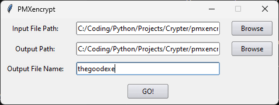
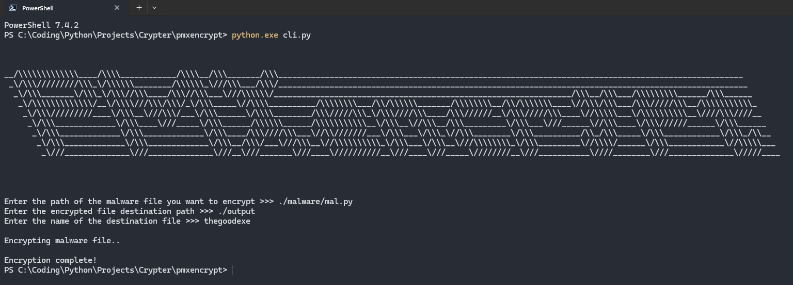

# PMXencrypt
Python Runtime Crypter v1.0

## Authors

Armaan ([@ArmaanLeg3nd](https://github.com/ArmaanLeg3nd))<br>
Adhip ([@BlBirb](https://github.com/BlBirb))

## What is this?
A crypter written in python for python-based malware which utilizes AES-GCM

This crypter utilizes the AES-GCM (Galois Counter Mode) since it takes any amount of data as input and is also fast during decryption and a crypter usually encrypts the code once and it is expected the malicious code decryption should be as efficient as possible.

## This tool is for educational purposes only

### Disclaimer
Before using this tool, please note that:

- <b>It is not intended for non-educational use:</b> The tool isn't intended to facilitate the use of malicious code and is not intended for anything other than educational purposes.
- <b>Use at your own risk:</b> While efforts have been made to ensure the tool's reliability, there may still be bugs or unintended behaviors.
- <b>No warranties:</b> There are no warranties or guarantees provided with the use of this tool. The developers and contributors are not liable for any damages or losses incurred through its use.

### In Action

#### Before Processing


#### After Processing


### How to Use

To get started with PMXencrypt python crypter, follow these steps:

1. Clone this repository
```shell
$ git clone https://github.com/ArmaanLeg3nd/pmxencrypt.git
```

2. Install the required dependencies

```shell
$ pip install -r '/_requirements.txt'
```

3. Run the following command or click on gui.py to start the tool on the gui (Windows only)
```shell
$ python.exe gui.py
```
Run the following command to start the tool on the cli (All platforms) 
```shell
$ python.exe cli.py
```

4. Enter the Input filepath, Output filepath and Output filename to proceed

5. Check the Output filepath for the Output file
6. Aaandd You're Done!

### Screenshots

- GUI: 

<br>
- CLI:


### Thanks to

- [https://github.com/the-xentropy/xencrypt](https://github.com/the-xentropy/xencrypt)
